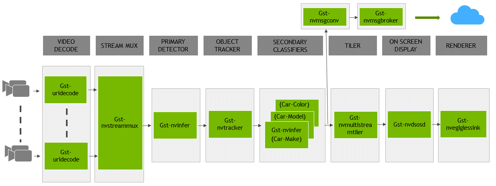

# Visual Anomaly Detection over multiple cameras with NVIDIA Jetson Nano devices workshop

In this workshop, you'll discover how to build a solution that can process up to 8 real-time video streams with an AI model on a $100 device, how to remotely operate your device, and demonstrate how you can deploy custom AI models to it.

With this solution, you can transform cameras into sensors to know when there is an available parking spot, a missing product on a retail store shelf, an anomaly on a solar panel, a worker approaching a hazardous zone., etc.

We'll build this solution using [NVIDIA Deepstream](https://developer.nvidia.com/deepstream-sdk) on a [NVIDIA Jetson Nano device](https://developer.nvidia.com/embedded/buy/jetson-nano-devkit) connected to Azure via [Azure IoT Edge](https://azure.microsoft.com/en-us/services/iot-edge/). Deepstream is an highly-optimized video processing pipeline, capable of running deep neural networks. It is a must-have tool whenever you have complex video analytics requirements like real-time object detection or when employing cascading AI models. IoT Edge gives you the possibility to run this pipeline next to your cameras, where the video data is being generated, thus lowering your bandwitch costs and enabling scenarios with poor internet connectivity or privacy concerns.

We'll operate this solution with an aesthetic UI provided by [IoT Central](https://azure.microsoft.com/en-us/services/iot-central/) and customize the objects detected in video streams using [Custom Vision](https://www.customvision.ai/), a service that automatically generates computer vision AI models from pictures.

## Prerequisites


- **Hardware**: You need a [NVIDIA Jetson Nano device](https://developer.nvidia.com/embedded/buy/jetson-nano-devkit) with a [5V-4A barrel jack power supply like this one](https://www.adafruit.com/product/1466), which are provided in this workshop.
- **A laptop**: You need a laptop to connect to your Jetson Nano device and see its results with a browser and an ssh client.
- **VLC**: To visualize the output of the Jetson Nano without HDMI screen (there is only one per table), we'll use VLC from your laptop to view a RTSP video stream of the processed videos. [Install VLC](https://www.videolan.org/vlc/index.html) if you dont have it yet.
- **Have an Azure subscription**: You need an Azure subscription to create an Azure IoT Central  application.
- **Have a phone with IP Camera Lite app**: To view & process a live video stream, you can use your phone with the IP Camera Lite app ([iOS](https://apps.apple.com/us/app/ip-camera-lite/id1013455241), [Android](https://play.google.com/store/apps/details?id=com.shenyaocn.android.WebCam&hl=en_US)) as an IP camera.

## Setting up a new IoT Central app

Let's create a new IoT Central app to which we will connect our Jetson Nano later on.

### Create a new IoT Central app

We'll start from a pre-built template of IoT Central, which already includes an application to see and command a video analytics solution running on the NVIDIA Jetson Nano.

- From your browser, go to: https://apps.azureiotcentral.com/build/new/fe45a50f-cd2a-4092-a371-2c279c57d6fd
- Give a name and URL to your application
- Select your Azure subscription (you can opt-in for a 7 day free trial)
- Select your location
- Click on `Create`

### Create an IoT Edge device from your IoT Central app

We'll create a new IoT Edge device in your IoT Central application that will enable to the NVIDIA Jetson Nano to connect to IoT Central.

- Go to the `Devices` tab
- Select the `NVIDIA Jetson Nano -- RTSP Output` device template
- Click on `New`
- Give a name to your device by editing the `Device ID` and the `Device name` fields (let's use the same name for both of these fields in this workshop)
- Click on `Create`
- Click on your new device
- Click on the `Connect` button in the top right corner
- Copy your `ID Scope` value, `Device ID` value and `Primary key` value and save them for later.

## Setting up your device

We'll start from a blank Jetson installation (Jetpack v4.3), copy a few files locally that are needed for the application such as video files to simulate RTSP cameras and deepstream configuration files, and install IoT Edge.

1. Follow the [instructions for creating a NVIDIA Jetson Nano base image with JetPack 4.3](https://developer.nvidia.com/embedded/jetson-nano-developer-kit)
2. Optionally [create a swapfile on the Jetson Nano](https://github.com/JetsonHacksNano/installSwapfile) to gain a bit more memory.
3. On your Jetson Nano create a folder name `data` at the root:

    ```bash
    sudo mkdir /data
    ```

4. Download and extra setup files in the `data` directory:

    ```bash
    cd /data
    sudo wget -O setup.tar.bz2 --no-check-certificate "https://onedrive.live.com/download?cid=0C0A4A69A0CDCB4C&resid=0C0A4A69A0CDCB4C%21588408&authkey=ALZecJdhgTgQM-8"
    sudo tar -xjvf setup.tar.bz2
    ```

5. Make the folder accessible from a normal user account:

    ```bash
    sudo chmod -R 777 /data
    ```

6. Install IoT Edge (instructions copied [from here](https://docs.microsoft.com/en-us/azure/iot-edge/how-to-install-iot-edge-linux) for convenience):

    ```bash
    curl https://packages.microsoft.com/config/ubuntu/18.04/multiarch/prod.list > ./microsoft-prod.list
    sudo cp ./microsoft-prod.list /etc/apt/sources.list.d/
    curl https://packages.microsoft.com/keys/microsoft.asc | gpg --dearmor > microsoft.gpg
    sudo cp ./microsoft.gpg /etc/apt/trusted.gpg.d/
    sudo apt-get update
    sudo apt-get install iotedge
    ```

7. Connect your device to your IoT Central application by editing IoT Edge configuration file:

    - Use your favorite text editor to edit IoT Edge configuration file:

    ```bash
    sudo nano /etc/iotedge/config.yaml
    ```

    - Comment out the "Manual provisioning configuration" section so it looks like this:

    ```bash
    # Manual provisioning configuration
    #provisioning:
    #  source: "manual"
    #  device_connection_string: ""
    ```

    - Uncomment the "DPS symmetric keyi provisioning configuration" and add your IoT Central app's scope id, registration_id which is your device Id and its primary symmetric key:

        ```bash
        # DPS symmetric key provisioning configuration
        provisioning:
        source: "dps"
        global_endpoint: "https://global.azure-devices-provisioning.net"
        scope_id: "<ID Scope>"
        attestation:
            method: "symmetric_key"
            registration_id: "<Device ID>"
            symmetric_key: "<Primary Key>"
        ```

    - Save and exit your editor (Ctrl+O, Ctrl+X)

    - Now Restart the Azure IoT Edge runtime with the following command:

    ```bash
    sudo systemctl restart iotedge
    ```

    - After a few moments the Edge runtime restarts and establishes a connection with your IoT Central application.

Note that the first time that you connect your IoT Edge device to IoT Central, it will take time to start the entire solution since it first needs to download ~2Gbs of IoT Edge modules.

## Running the solution

In the interest of time, we've already built a first solution that is composed of two main blocks:

1. **NVIDIA DeepStream** does all the video processing

    The first component, DeepStream, was trivial to build since it has been published by NVIDIA in the [Azure Marketplace here](https://azuremarketplace.microsoft.com/en-us/marketplace/apps/nvidia.deepstream-iot?tab=Overview). We're using this module as-is and are only configuring it from the IoT Central bridge module.


2. A **bridge to IoT Central** transforms DeepStream telemetry into a format understood by IoT Central and configures DeepStream remotely. It formats all telemetry, properties, and commands using PnP.

Let's see it in action!

1. Plug your device, and give it a few minutes to boot. It should automatically connect to the conference's wifi, start its application thanks to IoT Edge and report back its usage and IP address to IoT Central.
2. Connect to [this IoT Central application](https://deepstream-on-iot-edge.azureiotcentral.com/) with your Microsoft account. Please ask for help if you dont have access.
3. Go to `Devices` and find the device number corresponding to your Jetson Nano (You should have received this number from the proctors and will range from 01-45, for example if you received 01 then your device will be jetson-nano-01)
4. Click on this device and go to the `Dashboard` tab
5. Verify that active telemetry is being sent by the device to IoT Central
6. Copy the `RTSP Video URL` from the `Device` tab
7. Open VLC and go to `Media` > `Open Network Stream` and paste the `RTSP Video URL` copied above as the network URL and click `Play`

At this point, you should see 4 video streams being processed to detect cars and people with a Resnet 10 AI model.


### Understanding NVIDIA DeepStream

Deesptream is a SDK based on GStreamer. It is very modular with its concepts of plugins. Each plugins having `sinks` and `sources`. NVIDIA provides several plugins as part of Deepstream which optimized to leverage NVIDIA's GPUs. How these plugins are connected with each others in defined in the application's configuration file.

You can learn more about its architecture in [NVIDIA's official documentation](https://docs.nvidia.com/metropolis/deepstream/dev-guide/index.html#page/DeepStream_Development_Guide%2Fdeepstream_app_architecture.html) (sneak peak below).

.

To better understand how NVIDIA DeepStream works, let's have a look at its configuration file.

From your favourite SSH client:

1. Open an SSH connection with the IP address found in the `RTSP Video URL` field above. Username is `iotedge` and so is the default password.

    ```bash
    ssh iotedge@YOUR_IP_ADDRESS
    ```

2. Open up the configuration file of DeepStream to understand its structure:

    ```bash
    nano /data/misc/storage/DSconfig.txt
    ```

Observe in particular:

- The `sources` sections: they define where the source videos are coming from. We're using local videos to begin with and will switch to live RTSP streams later on.
- The `sink` sections: they define where to output of the processed videos and the output messages. We use RTSP to stream a video feed out and all out messages are sent to the Azure IoT Edge runtime.
- The `primary-gie` section: it defines which AI model is used to detect objects. It also defines how this AI model is applied. As an example, note the `interval` property set to `4`: this means that inferencing is actually executed only once every 5 frames. Bounding boxes are displayed continuously though because a tracking algorithm, which is computationally less expensive than inferencing, takes over in between. The tracking algorithm used is set in the `tracking` section. This is the kind of out-of-the-box optimizations provided by DeepStream that enables us to process 240 frames per second on a $100 device. Other notable optimizations are using hardware decoders, doing zero in-memory copy, pushing the vast majority of the processing to the GPU, batching frames from multiple streams, etc.

### Understanding the connection to IoT Central

IoT Edge connects to IoT Central with the regular Module SDK. Telemetry, Properties and Commands that the IoT Edge Central bridge module sends follow a PnP format, enforced in the Cloud by IoT Central. IoT Central enforces them against a Device Capability Model, which is a file that defines what this IoT Edge device is capable of doing.

- Click on `Devices` in the left nav of the IoT Central application
- Observe the templates in the second column: they define all the devices that this IoT Central application understands. All the Jetson Nano devices of this workshop are using a version of the `NVIDIA Jetson Nano (Airlift)` device template. In the case of IoT Edge, an IoT Edge deployment manifest is attached to a DCM version to create a device template. If you want to see the details on how a Device Capability Model look like, you can look at [this file in this repo](https://github.com/ebertrams/iotedge-iva-nano/blob/master/NVIDIAJetsonNanoDcm.json).

## Operating the solution

Now that we understand how the application has been built, let's operate it with IoT Central. To demonstrate how to remotely manage this solution, we'll send a command to the device to change its input cameras. We'll use your phone as an RTSP camera as a new input camera.


### Changing input cameras

Let's first verify that your phone works as an RTSP camera properly:

- Open the the IP Camera Lite
- Go to Settings and remove the User and Password on the RTSP feed
- Click on `Turn on IP Camera Server`


Let's just verify that the camera is functional. With VLC:

- Go to `Media` > `Open Network Stream`
- Paste the following `RTSP Video URL`:  `rtsp://your-phone-ip-address:8554/live`
- Click `Play` and verify that phone's camera is properly displaying.

Let's now update your Jetson Nano to use your phone's camera. In IoT Central:

- Go to the `Manage` tab
- Unselect the `Demo Mode`, which uses several hardcoded video files as input of car traffic
- Update the `Video Stream 1` property:
    - In the `cameraId`, name your camera, for instance `My Phone`
    - In the `videoStreamUrl`, enter the RTSP stream of this camera: `rtsp://your-phone-ip-address:8554/live`
- Keep the default AI model of DeepStream by keeping the value `DeepStream ResNet 10` as the `AI model type`.
- Keep the default `Primary Detection Class` as `person`
- Hit `Save`

This sends a command to the device to update its DeepStream configuration file with these new properties and to restart DeepStream. If you were still streaming the output of the DeepStream application, this streem will be taken down as DeepStream will restart.

Within a minute, DeepStream should restart. You can observe its status in IoT Central via the `Modules` tab. Once `deepstream` module is back to `Running`, copy again the `RTSP Video Url` field from the `Device` tab and give it to VLC (`Media` > `Open Network Stream` > paste the `RTSP Video URL` > `Play`).

You should now detect people from your phone's camera. The count of `Person` in the `dashboard` tab in IoT Central should go up. We've just remotely updated the configuration of this intelligent video analytics solution!

## Use an AI model to detect custom visual anomalies

A soda can manufaturer wants to improve the efficienty of its plant. He would like to be able to take soda cans that fell down on his production lines to avoid slow downs.
We'll use cameras to monitor each of the lines and we'll collect images and build a custom AI model to detects cans that are up or down. We'll then deploy this custom AI model to DeepStream via IoT Central. To do a quick Proof Of Concept, we'll use the [Custom Vision service](https://www.customvision.ai/), a no-code computer vision AI model builder.

As a pre-requisite, let's create a new Custom Vision project in your subscription:

- Go to [http://customvision.ai](https://www.customvision.ai/)
- Sign-in
- Create a new Project
- Give it a name like `Soda Cans Down`
- Pick up your resource, if none select `create new` and select `SKU - F0` or (S0)
- Select `Project Type` = `Object Detection`
- Select `Domains` = `General (Compact)`

We then need to collect images to build a custom AI model. To do that, we'll use a utility that captures images from RTSP video streams. It has already been deployed on the Jetson Nano as a module named `CameraTaggingModule`. To acces it, go to the `Device` tab in IoT Central and copy/paste the `Video Tagging Client Url` into your laptop's browser.

From the Camera Tagging Module:

- Connect to one of the camera of the manufacturing line:
    - `Change camera` (you may have to scroll down to see the button)
    - Add your phone's camera as a new RTSP camera
- Capture a few images of cans that are up and cans that are down
- Once a few images have been capture, go to upload and enter your Custom Vision settings
- Finally, go to the image gallery, select the ones that you want to upload and upload them to Custom Vision

In the interest of time, [here](https://1drv.ms/u/s!AEzLzaBpSgoMo-1l) is a set of images that have already been captured for you that you can upload to Custom Vision. Download it, unzip it and upload all the images into your Custom Vision project.

We then need to label all of them:

- Click on one image
- Label the cans that are up as `Up` and the ones that are down as `Down`
- Hit the right arrow to move on to the next image and label the remaining 70+ images...or read below to use a pre-built one with this set of images
- Once you're done labeling, click on `Train`
- To export it, go to the `Performance` tab, click on `Export` and choose `ONNX`
- Right-click on the `Download` button and select `copy link address` to copy the anonymous location of a zip file of your ccustom model

In the interest of time, you can use [this pre-built Custom Vision model](https://onedrive.live.com/download?0C0A4A69A0CDCB4C&resid=0C0A4A69A0CDCB4C%21587636&authkey=AOCf3YsqcZM_3WM).

Finally, we'll deploy this custom vision model to the Jetson Nano using IoT Central. In IoT Central:

- Go to the `Manage` tab (beware of the sorting o f the fields)
- Make sure the `Demo Mode` is unchecked
- The 3 input video for 3 manufacturing lines have been hardcoded into the device to avoid network issues. You would normally have to input valid RTSP input sources in the first 3 Video Stream Url properties. You can put any values for now in these fields.
- Select `Custom Vision` as the `AI model Type`
- Paste the URI of your custom vision model in the `Custom Vision Model Url`
- Update the `Primary Detection Class` to be `Up` and the `Secondary Detection Class` to be `Down`
- Hit `Save`

After a few moments, the `deepstream` module should restart. Once it is in `Running` state again, look at the output RTSP stream via VLC (`Media` > `Open Network Stream` > paste the `RTSP Video URL` that you got from the IoT Central's `Device` tab > `Play`).

We are now visualizing the processing of 3 real time (e.g. 30fps 1080p) video feeds with a custom vision AI models that we built in minutes to detect visual anomalies!


Thank you for attending this workshop! There are other content that you can try with your Jetson Nano at [http://aka.ms/jetson-on-azure](http://aka.ms/jetson-on-azure)!
